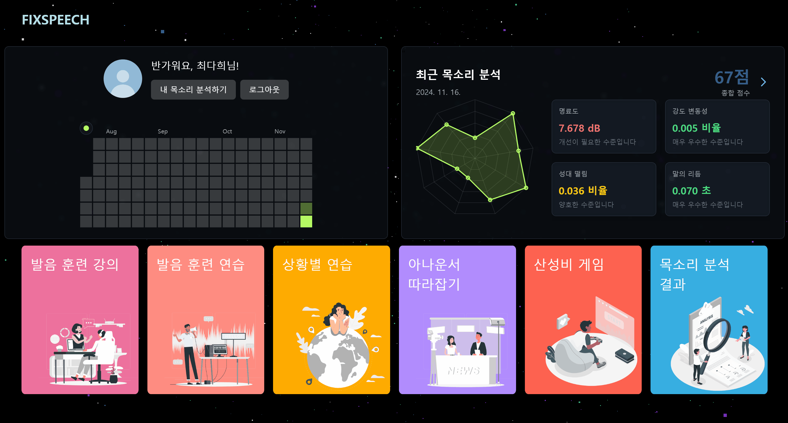
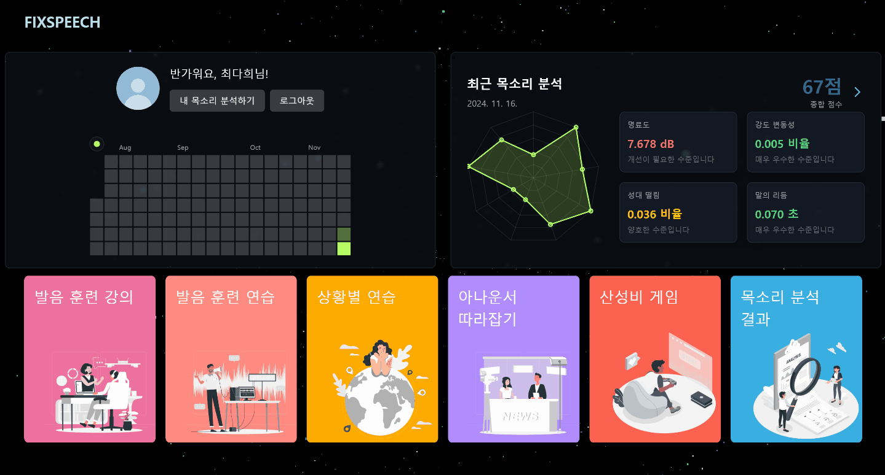
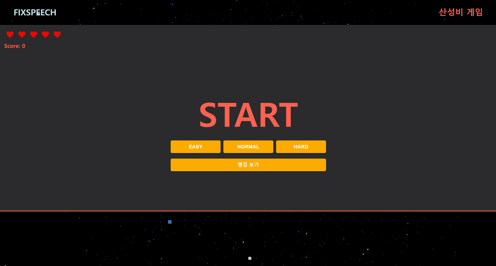
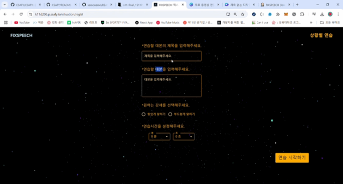
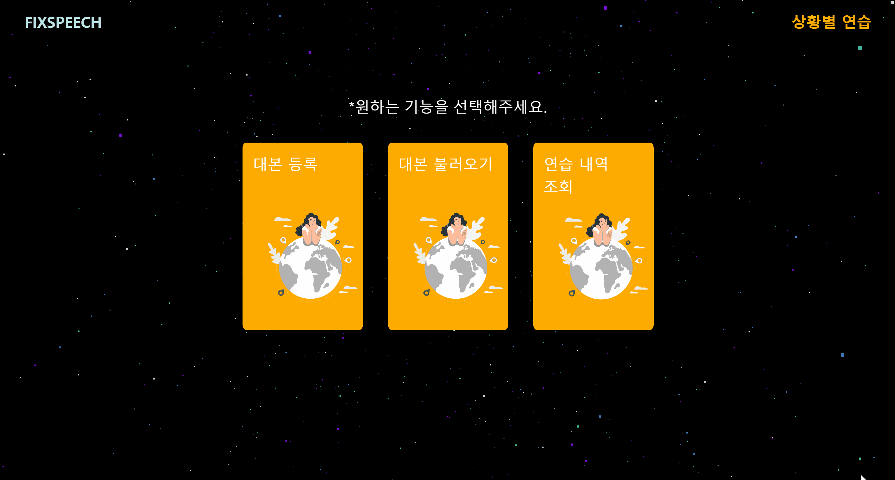
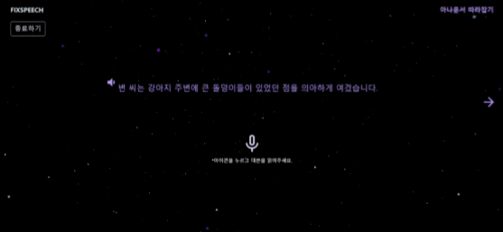
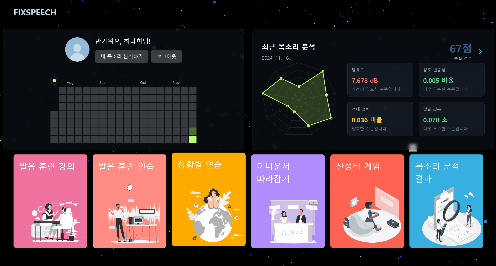
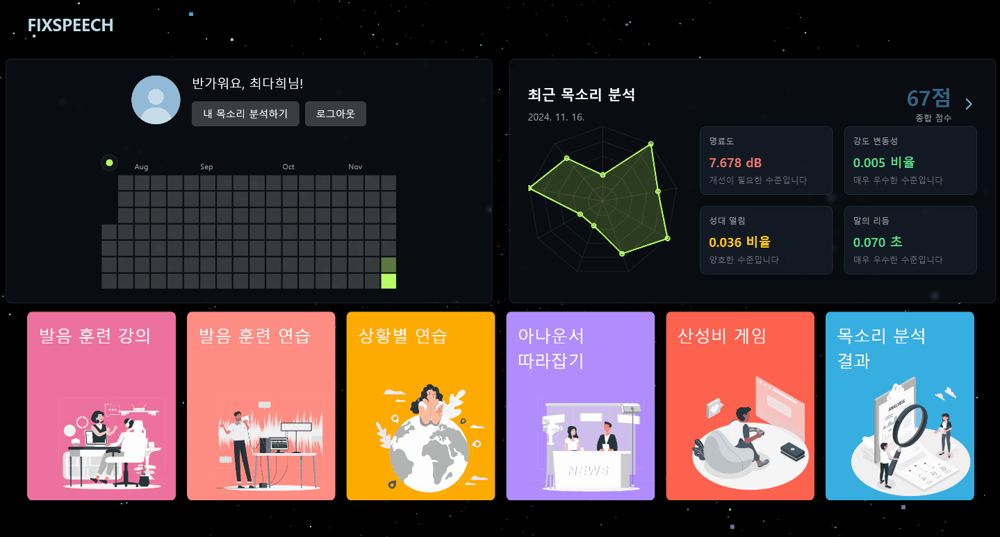
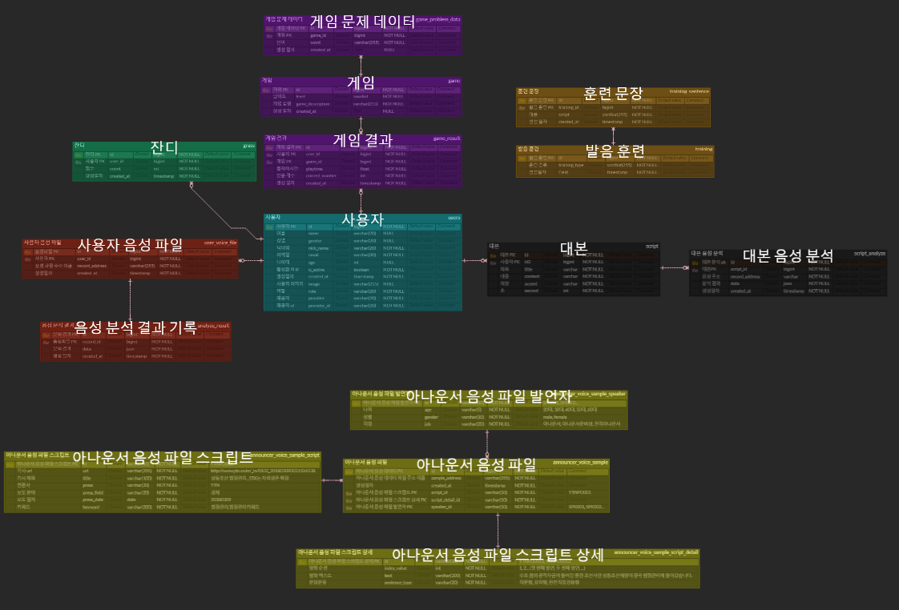

# FIXSPEECH


## 📘 프로젝트 진행 기간

SSAFY 11기 2학기 자율 프로젝트

2024.10.14(월) ~ 2024.11.19(화)

## 🔎 FIXSPEECH - 개요

**FixSpeech**는 발표와 면접에 어려움을 겪는 사람들 위한 온라인 보이스 트레이닝 서비스입니다.

# 💎 주요 기능

## 📊 내 목소리 분석

### 1. 음성 녹음 및 분석

> - 목소리를 녹음하면 명료도, 말의 리듬, 일관성 등을 분석하여 사용자에게 제공합니다.


### 2. 분석 결과 조회

> - 사용자는 언제든지 자신의 녹음 파일과 분석 결과를 확인할 수 있습니다.



## 🎮 게임

### 1. 산성비 게임

> - 하늘에서 떨어지는 단어들을 빠르고 정확하게 발음하여, 땅에 닿지 않도록 해야합니다.
> - 상, 중, 하의 난이도로 이루어져 있습니다.



### 2. 게임 랭킹 조회

> - 실시간 게임 랭킹 조회 가능합니다.



## 📃 대본 훈련

### 1. 대본 생성 및 조회

> - 발표에 사용할 대본을 작성하고 저장할 수 있습니다.



### 2. 음성 분석 및 알림

> - 사용자가 분석 완료 응답을 기다릴 필요 없도록 알림으로 알려드립니다.


### 3. 대본 연습 결과 조회

> - 사용자는 언제든지 자신의 연습 결과를 확인해볼 수 있습니다.



## 🎙 아나운서 따라잡기

### 1. 아나운서 음성 제공

> - 실제 아나운서의 음성 파일과 대본을 보여줍니다,
> - 대본을 따라 읽고 녹음할 수 있습니다.

### 2. 음성 분석

> - 아나운서와 사용자의 음성 분석 결과를 비교해 볼 수 있습니다.



## 🎯 발음 훈련

### 1. 문장 종류 선택

> - 일상적인 문장과 잰말놀이 문장 중에 선택할 수 있습니다.

### 2. 문장 따라 읽기

> - 주어진 문장을 따라 읽으며 녹음하면, 사용자의 발음과 문장이 어느정도 일치하는 보여줍니다.



## 📖 발음 훈련 강의

### 1. AI 추천 발음 개선 방법 추천

> - AI가 사용자의 목소리를 분석해 그에 맞는 목소리 훈련 방법을 추천해줍니다.

### 2. 맞춤형 강의 추천

> - 사용자의 부족한 점을 살펴 맞춤형 강의를 제공해줍니다.



# ERD



# System Architecture


# Project Folder Structure

<table>
<tr style="vertical-align: top;">
<td>
<div>
<p style="font-weight: bold">frontend</p>

```bash
frontend
├── public
│   ├── buttons
│   └── icons
└── src
    ├── pages
    │   ├── AnnouncerPractice
    │   ├── Game
    │   ├── Lecture
    │   ├── Login
    │   ├── MainPage
    │   ├── PronounceTraining
    │   ├── SituationPractice
    │   └── VoiceAnalysis
    ├── services
    │   ├── AnnouncerPractice
    │   ├── Game
    │   ├── PronouncePractice
    │   ├── SituationPractice
    │   └── VoiceAnalysis
    └── shared
        ├── components
        │   ├── Header
        │   ├── Icons
        │   ├── Loader
        │   ├── PracticePronounce
        │   ├── Visualizer
        │   └── VoiceQuality
        ├── constants
        ├── routes
        ├── sounds
        ├── stores
        ├── styles
        └── types
```

</div>
</td>
<td>
<div>
<p style="font-weight: bold">backend</p>

```bash
backend
├── config
│   ├── kafka
│   ├── redis
│   └── s3
├── domain
│   ├── announcer
│   ├── game
│   ├── grass
│   ├── notification
│   ├── oauth
│   ├── record
│   ├── script
│   ├── training
│   ├── user
│   └── youtube
├── filter
├── global
│   ├── common
│   └── exception
└── utils

```

</div>
</td>
</tr>
</table>
